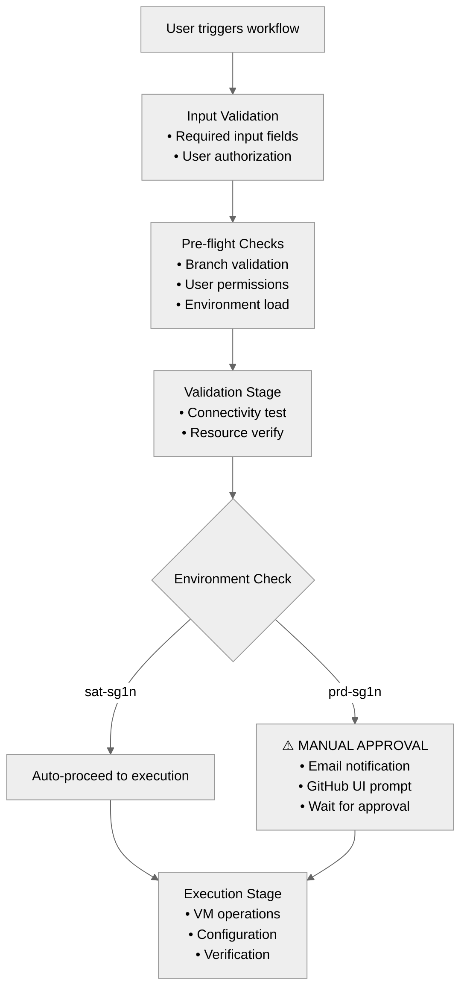

# Architecture 

## Topology


## Requirements

**Platform**:

- VMware vSphere 7.0 Update 3D or higher.
- Ansible-Core 2.19 or higher.
- HashiCorp Vault 1.20.0 or higher.
- Python 3.10 or higher.

```note
Note: This Github Actions workflow is currently dependent on the SAT Environment
```
## Configuration

<details>
   <summary><i><b>The directory structure of the repository.</b></i></summary>

   ```console
   ├── ansible
   │   ├── ansible.cfg
   │   ├── inventories
   │   │   ├── prd-sg1n
   │   │   │   ├── group_vars
   │   │   │   │   └── all.yml
   │   │   │   └── hosts
   │   │   └── sat-sg1n
   │   │       ├── group_vars
   │   │       │   └── all.yml
   │   │       └── hosts
   │   ├── prepare_environment.yml
   │   ├── roles
   │   │   ├── esxi
   │   │   │   ├── defaults
   │   │   │   │   └── main.yml
   │   │   │   └── tasks
   │   │   │       ├── drs_groups.yml
   │   │   │       ├── ha.yml
   │   │   │       └── main.yml
   │   │   ├── vm_decom_execute
   │   │   │   ├── defaults
   │   │   │   ├── files
   │   │   │   ├── tasks
   │   │   │   │   └── main.yml
   │   │   │   └── templates
   │   │   ├── vm_decom_validate
   │   │   │   ├── defaults
   │   │   │   ├── files
   │   │   │   ├── tasks
   │   │   │   │   └── main.yml
   │   │   │   └── templates
   │   │   ├── vm_operation
   │   │   │   ├── defaults
   │   │   │   ├── files
   │   │   │   ├── tasks
   │   │   │   │   ├── check.yml
   │   │   │   │   ├── main.yml
   │   │   │   │   └── run.yml
   │   │   │   └── templates
   │   │   └── vm_snapshot
   │   │       ├── defaults
   │   │       ├── files
   │   │       ├── tasks
   │   │       └── templates
   │   └── vcenter_decom_vm.yml
   ├── build-env
   │   ├── prd-sg1n.env
   │   └── sat-sg1n.env
   ├── Dockerfile
   ├── docs
   │   ├── Architecture.md
   │   ├── book.toml
   │   ├── Introduction.md
   │   ├── picture
   │   │   ├── ansible-snapshot-workflow.svg
   │   │   ├── diagram.svg
   │   │   └── gitlab.png
   │   └── SUMMARY.md
   ├── README.md
   └── requirements
      ├── requirements.apt
      ├── requirements.txt
      └── requirements.yml

   34 directories, 30 files
   ```
</details>

## Workflow Execution Deep Dive

### Compliance Controls

**SOC 2 / ISO 27001 Alignment**:
- ✅ Access controls (multi-layer authentication)
- ✅ Environmental separation (sat/prod isolation)
- ✅ Segregation of duties (approval workflows)
- ✅ Security scanning (GitLeaks, YAML validation)
- ✅ Change management (ServiceNow integration)
- ✅ Audit trails (comprehensive logging)

### Input Parameter Processing

When users trigger workflows through GitHub Actions UI:

```yaml
workflow_dispatch:
  inputs:
    change_request_number: 
      description: "ServiceNow Change Request ID (e.g., CHG0000001)"
      required: true
      default: "CHG0000001"
    
    build_site:
      type: choice
      description: "Deployment environment/site"
      required: true
      default: "sat-sg1n"
      options:
        - "sat-sg1n"    # Development/Testing
        - "prd-sg1n"    # Production
    
    target_group:
      description: "Target host group(s) or VM(s) from Ansible inventory"
      required: true
      default: "vm-db,vm-non-db"
```

### Concurrency Control

- Groups workflow runs under a unique key, so only one run per group is active at a time.

   ```yaml
   concurrency:
   group: ansible-${{ github.ref }}-${{ inputs.target_group }}
   cancel-in-progress: false  # Prevent conflicting operations
   ```

- Allows multiple runs in the same group to continue without canceling previous ones, preventing job interruption but risking conflicts if operations overlap.

### Environment Variable Loading

**Dynamic Environment Loading**:
```bash
# Load site-specific configuration
grep -v -e '^\s*#' -e '^\s*$' "build-env/${{ inputs.build_site }}.env" >> $GITHUB_ENV

# Example: sat-sg1n.env
ANSIBLE_CONFIG=ansible.cfg
ANSIBLE_RUNNER=sat-sg1n
ANSIBLE_IMAGE=ghcr.io/mercurybridge/iac-vsphere:sat-sg1n-latest

# Example: prd-sg1n.env  
ANSIBLE_CONFIG=ansible.cfg
ANSIBLE_RUNNER=prd-sg1n
ANSIBLE_IMAGE=ghcr.io/mercurybridge/iac-vsphere:sat-sg1n-latest
```

## Secrets & Vault Integration Architecture

### GitHub Secrets Configuration

```yaml
secrets:
  GITHUB_TOKEN:                   # Auto-generated (registry access)
  ANSIBLE_HASHI_VAULT_ADDR:       # https://vault.company.com:8200
  ANSIBLE_HASHI_VAULT_TOKEN:      # hvs.XXXXXX (service account token)
  ANSIBLE_HASHI_VAULT_PATH_BASE:  # secret/kv/vsphere/prod
  GITLEAKS_LICENSE:               # GitLeaks license key
```

### Vault Integration Flow

```
┌─────────────────┐
│ GitHub Action   │
│ Secrets:        │
│ • VAULT_ADDR    │ ──┐
│ • VAULT_TOKEN   │   │
│ • VAULT_PATH    │   │
└─────────────────┘   │
                      │
                      ▼
┌───────────────────────────────────────────────────┐
│ Container Environment Variables                   │
│ export ANSIBLE_HASHI_VAULT_ADDR=$VAULT_ADDR       │
│ export ANSIBLE_HASHI_VAULT_TOKEN=$VAULT_TOKEN     │
│ export ANSIBLE_HASHI_VAULT_PATH_BASE=$VAULT_PATH  │
└───────────────────────────────────────────────────┘
                      │
                      ▼
┌───────────────────────────────────────────────────────────────┐
│ Ansible group_vars/all.yml                                    │
│ hv: "community.hashi_vault.hashi_vault"                       │
│ hv_query_base: >-                                             │
│   url={{ lookup('env', 'ANSIBLE_HASHI_VAULT_ADDR') }}         │
│   token={{ lookup('env', 'ANSIBLE_HASHI_VAULT_TOKEN') }}      │
│   secret={{ lookup('env', 'ANSIBLE_HASHI_VAULT_PATH_BASE') }} │
└───────────────────────────────────────────────────────────────┘
                      │
                      ▼
┌──────────────────────────────────────────────────────────────────────────┐
│ Runtime Variable Resolution                                              │
│ vsphere_endpoint:   "{{ lookup(hv, hv_query_base).VSPHERE_ENDPOINT }}"   │
│ vsphere_username:   "{{ lookup(hv, hv_query_base).VSPHERE_USERNAME }}"   │
│ vsphere_password:   "{{ lookup(hv, hv_query_base).VSPHERE_PASSWORD }}"   │
│ vsphere_datacenter: "{{ lookup(hv, hv_query_base).VSPHERE_DATACENTER }}" │
└──────────────────────────────────────────────────────────────────────────┘
                      │
                      ▼
┌──────────────────────────────────────────┐
│ VMware vCenter Connection                │
│ • Authentication via service account     │
│ • Resource access based on permissions   │
└──────────────────────────────────────────┘
```

## Approval Workflow Deep Dive

### Environment Protection Rules

**GitHub Repository Settings → Environments**:

```yaml
# Development Environment
sat-sg1n:
  protection_rules: []              # No approval required

prd-sg1n:
  protection_rules:
    - type: required_reviewers
      reviewers:
        - duongvanthanh1992         # Primary approver
        - HenryHien                 # Team-based approval
      prevent_self_review: true     # Requestor cannot approve own changes
```

### Approval Process Flow



## Ansible Task Workflow Architecture

### Infrastructure as Code (IaC) Host Definition

The **Ansible inventory file** (`hosts`) is the single source of truth for VM lifecycle and ownership.

- **Presence in file** : VM is declared to exist (`state: present`).
- **Absence in file** : VM is not managed / should be removed (`state: absent`).
- **Owner attribution** : Each VM entry includes `input_vm_service_owner`, ensuring accountability and traceability.
- This enforces **IaC principles**: infrastructure state, existence, and ownership are explicitly codified in version-controlled inventory files.

### Dynamic Inventory Processing

**Inventory Structure**:
```ini
# ansible/inventories/sat-sg1n/hosts
[vm-db]
sat-sg1n-vm-db-01 vm_deploy_ip=172.16.14.75 input_state_group=present input_vm_service_owner=HendryDing
sat-sg1n-vm-db-02 vm_deploy_ip=172.16.14.76 input_state_group=present input_vm_service_owner=EuHock

[vm-non-db]  
sat-sg1n-vm-non-db-01 vm_deploy_ip=172.16.14.77 input_state_group=present input_vm_service_owner=Hien
sat-sg1n-vm-non-db-02 vm_deploy_ip=172.16.14.78 input_state_group=present input_vm_service_owner=Tony
```

**Target Group Processing**:
```bash
# User input: "vm-db,vm-non-db" 
# Ansible processes as: hosts: "{{ input_target_group }}"
# Results in: hosts: "vm-db,vm-non-db"
# Executes against all VMs in both groups
```

### Pre-deployment Validation

This stage ensures **critical dependencies** are reachable before any VM operations:

- **HashiCorp Vault check** → Confirms secret manager is online and accessible with a valid token. Prevents failures due to missing credentials.
- **vCenter connectivity check** → Validates VMware endpoint availability with provided credentials. Ensures the automation can interact with vSphere before proceeding.

```yaml
tasks:
  - name: HashiCorp-Vault connectivity check
    uri:
      url: "{{ lookup('env', 'ANSIBLE_HASHI_VAULT_ADDR') }}/v1/sys/health"
      headers:
        X-Vault-Token: "{{ lookup('env', 'ANSIBLE_HASHI_VAULT_TOKEN') }}"
      method: GET
      timeout: 10
    register: _vault_health
    
  - name: vCenter connectivity check
    community.vmware.vmware_about_info:
      hostname: "{{ vsphere_endpoint }}"
      username: "{{ vsphere_username }}"
      password: "{{ vsphere_password }}"
      validate_certs: "{{ vsphere_validate }}"
    register: _vcenter_info

```

### VM Operation Workflow

```yaml
annotation: |
  Deploy via Ansible Workflow
    • Timestamp         : 2025-08-28 14:30
    • ServiceNow ID     : CHG0000001
    • Initiated By      : duongvanthanh1992
    • Owner             : Tony
```
Each workflow execution embeds an **immutable audit trail** inside vCenter VM annotations:

- **Timestamp** → Exact execution time.
- **ServiceNow ID** → Change request or ticket reference.
- **Initiated By** → User who triggered the workflow.
- **Owner** → Service/application owner responsible for the VM.

This provides **end-to-end accountability**:

- What action happened
- When it happened
- Who requested and executed it
- Who owns the resource afterwards

Together with the **IaC inventory definition**, this ensures that VM existence, lifecycle, and ownership are **fully codified, auditable, and reproducible**.


