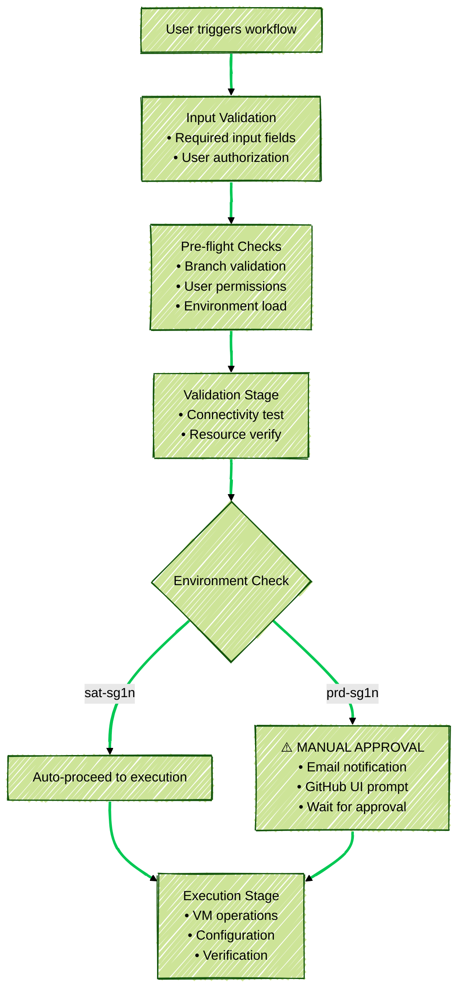

# Architecture

This architecture defines an **end-to-end automated workflow** for managing VMware infrastructure using **Ansible**, **HashiCorp Vault**, and **GitHub Actions**. It covers infrastructure provisioning, configuration, secrets management, compliance enforcement, approval flows, and operational auditing.  

The design ensures **security, accountability, and reproducibility** across environments.

## Table of Contents

<!-- TOC -->
- [Architecture](#architecture)
  - [Topology](#topology)
  - [Requirements](#requirements)
  - [Configuration](#configuration)
  - [Workflow Execution Deep Dive](#workflow-execution-deep-dive)
    - [Compliance Controls](#compliance-controls)
    - [Input Parameter Processing](#input-parameter-processing)
    - [Concurrency Control](#concurrency-control)
    - [Environment Variable Loading](#environment-variable-loading)
  - [Secrets & Vault Integration Architecture](#secrets--vault-integration-architecture)
    - [GitHub Secrets Configuration](#github-secrets-configuration)
    - [Vault Integration Flow](#vault-integration-flow)
  - [Approval Workflow Deep Dive](#approval-workflow-deep-dive)
    - [Environment Protection Rules](#environment-protection-rules)
    - [Approval Process Flow](#approval-process-flow)
  - [Ansible Task Workflow Architecture](#ansible-task-workflow-architecture)
    - [Infrastructure as Code (IaC) VM Definition & Dynamic Inventory Processing](#infrastructure-as-code-iac-vm-definition--dynamic-inventory-processing)
    - [Pre-deployment Validation](#pre-deployment-validation)
    - [VM Operation Workflow](#vm-operation-workflow)
<!-- TOC -->

## Topology


## Requirements

**Platform**:

- VMware vSphere 7.0 Update 3D or higher.
- Ansible-Core 2.19 or higher.
- HashiCorp Vault 1.20.0 or higher.
- Python 3.10 or higher.

```note
Note: This Github Actions workflow is currently dependent on the SAT Environment
```

## Configuration

<details>
   <summary><i><b>The directory structure of the repository.</b></i></summary>

   ```console
   ├── ansible
   │   ├── ansible.cfg
   │   ├── inventories
   │   │   ├── prd-sg1n
   │   │   │   ├── group_vars
   │   │   │   │   └── all.yml
   │   │   │   └── hosts
   │   │   └── sat-sg1n
   │   │       ├── group_vars
   │   │       │   └── all.yml
   │   │       └── hosts
   │   ├── prepare_environment.yml
   │   ├── roles
   │   │   ├── esxi
   │   │   │   ├── defaults
   │   │   │   │   └── main.yml
   │   │   │   └── tasks
   │   │   │       ├── drs_groups.yml
   │   │   │       ├── ha.yml
   │   │   │       └── main.yml
   │   │   ├── vm_decom_execute
   │   │   │   ├── defaults
   │   │   │   ├── files
   │   │   │   ├── tasks
   │   │   │   │   └── main.yml
   │   │   │   └── templates
   │   │   ├── vm_decom_validate
   │   │   │   ├── defaults
   │   │   │   ├── files
   │   │   │   ├── tasks
   │   │   │   │   └── main.yml
   │   │   │   └── templates
   │   │   ├── vm_operation
   │   │   │   ├── defaults
   │   │   │   ├── files
   │   │   │   ├── tasks
   │   │   │   │   ├── check.yml
   │   │   │   │   ├── main.yml
   │   │   │   │   └── run.yml
   │   │   │   └── templates
   │   │   └── vm_snapshot
   │   │       ├── defaults
   │   │       ├── files
   │   │       ├── tasks
   │   │       └── templates
   │   └── vcenter_decom_vm.yml
   ├── build-env
   │   ├── prd-sg1n.env
   │   └── sat-sg1n.env
   ├── Dockerfile
   ├── docs
   │   ├── Architecture.md
   │   ├── book.toml
   │   ├── Introduction.md
   │   ├── picture
   │   │   ├── ansible-snapshot-workflow.svg
   │   │   ├── diagram.svg
   │   │   └── gitlab.png
   │   └── SUMMARY.md
   ├── README.md
   └── requirements
      ├── requirements.apt
      ├── requirements.txt
      └── requirements.yml

   34 directories, 30 files
   ```
</details>

## Workflow Execution Deep Dive
[⬆ Back to Table of Contents](#table-of-contents)

### Compliance Controls

**SOC 2 / ISO 27001 Alignment**:
- ✅ Access controls (multi-layer authentication)
- ✅ Environmental separation (sat/prod isolation)
- ✅ Segregation of duties (approval workflows)
- ✅ Security scanning (GitLeaks, YAML validation)
- ✅ Change management (ServiceNow integration)
- ✅ Audit trails (comprehensive logging)

### Input Parameter Processing

When users trigger workflows through GitHub Actions UI:

  ```yaml
  workflow_dispatch:
    inputs:
      change_request_number: 
        description: "ServiceNow Change Request ID (e.g., CHG0000001)"
        required: true
        default: "CHG0000001"
      
      build_site:
        type: choice
        description: "Deployment environment/site"
        required: true
        default: "sat-sg1n"
        options:
          - "sat-sg1n"    # Development/Testing
          - "prd-sg1n"    # Production
      
      target_group:
        description: "Target host group(s) or VM(s) from Ansible inventory"
        required: true
        default: "vm-db,vm-non-db"
  ```

### Concurrency Control
[⬆ Back to Table of Contents](#table-of-contents)

- Groups workflow runs under a unique key, so only one run per group is active at a time.

   ```yaml
   concurrency:
   group: ansible-${{ github.ref }}-${{ inputs.target_group }}
   cancel-in-progress: false  # Prevent conflicting operations
   ```

- Allows multiple runs in the same group to continue without canceling previous ones, preventing job interruption but risking conflicts if operations overlap.

### Environment Variable Loading

**Dynamic Environment Loading**:
```bash
# Load site-specific configuration
grep -v -e '^\s*#' -e '^\s*$' "build-env/${{ inputs.build_site }}.env" >> $GITHUB_ENV

# Example: sat-sg1n.env
ANSIBLE_CONFIG=ansible.cfg
ANSIBLE_RUNNER=sat-sg1n
ANSIBLE_IMAGE=ghcr.io/mercurybridge/iac-vsphere:sat-sg1n-latest

# Example: prd-sg1n.env  
ANSIBLE_CONFIG=ansible.cfg
ANSIBLE_RUNNER=prd-sg1n
ANSIBLE_IMAGE=ghcr.io/mercurybridge/iac-vsphere:sat-sg1n-latest
```

## Secrets & Vault Integration Architecture
[⬆ Back to Table of Contents](#table-of-contents)

### GitHub Secrets Configuration

```yaml
secrets:
  GITHUB_TOKEN:                   # Auto-generated (registry access)
  ANSIBLE_HASHI_VAULT_ADDR:       # https://vault.company.com:8200
  ANSIBLE_HASHI_VAULT_TOKEN:      # hvs.XXXXXX (service account token)
  ANSIBLE_HASHI_VAULT_PATH_BASE:  # secret/kv/vsphere/prod
  GITLEAKS_LICENSE:               # GitLeaks license key
```

### Vault Integration Flow

```
┌─────────────────┐
│ GitHub Action   │
│ Secrets:        │
│ • VAULT_ADDR    │ ──┐
│ • VAULT_TOKEN   │   │
│ • VAULT_PATH    │   │
└─────────────────┘   │
                      │
                      ▼
┌───────────────────────────────────────────────────┐
│ Container Environment Variables                   │
│ export ANSIBLE_HASHI_VAULT_ADDR=$VAULT_ADDR       │
│ export ANSIBLE_HASHI_VAULT_TOKEN=$VAULT_TOKEN     │
│ export ANSIBLE_HASHI_VAULT_PATH_BASE=$VAULT_PATH  │
└───────────────────────────────────────────────────┘
                      │
                      ▼
┌───────────────────────────────────────────────────────────────┐
│ Ansible group_vars/all.yml                                    │
│ hv: "community.hashi_vault.hashi_vault"                       │
│ hv_query_base: >-                                             │
│   url={{ lookup('env', 'ANSIBLE_HASHI_VAULT_ADDR') }}         │
│   token={{ lookup('env', 'ANSIBLE_HASHI_VAULT_TOKEN') }}      │
│   secret={{ lookup('env', 'ANSIBLE_HASHI_VAULT_PATH_BASE') }} │
└───────────────────────────────────────────────────────────────┘
                      │
                      ▼
┌──────────────────────────────────────────────────────────────────────────┐
│ Runtime Variable Resolution                                              │
│ vsphere_endpoint:   "{{ lookup(hv, hv_query_base).VSPHERE_ENDPOINT }}"   │
│ vsphere_username:   "{{ lookup(hv, hv_query_base).VSPHERE_USERNAME }}"   │
│ vsphere_password:   "{{ lookup(hv, hv_query_base).VSPHERE_PASSWORD }}"   │
│ vsphere_datacenter: "{{ lookup(hv, hv_query_base).VSPHERE_DATACENTER }}" │
└──────────────────────────────────────────────────────────────────────────┘
                      │
                      ▼
┌──────────────────────────────────────────┐
│ VMware vCenter Connection                │
│ • Authentication via service account     │
│ • Resource access based on permissions   │
└──────────────────────────────────────────┘
```

## Approval Workflow Deep Dive
[⬆ Back to Table of Contents](#table-of-contents)

### Environment Protection Rules

**GitHub Repository Settings → Environments**:

```yaml
# Development Environment
sat-sg1n:
  protection_rules: []              # No approval required

prd-sg1n:
  protection_rules:
    - type: required_reviewers
      reviewers:
        - duongvanthanh1992         # Primary approver
        - HenryHien                 # Team-based approval
      prevent_self_review: true     # Requestor cannot approve own changes
```

### Approval Process Flow



## Ansible Task Workflow Architecture
[⬆ Back to Table of Contents](#table-of-contents)

### Infrastructure as Code (IaC) VM Definition & Dynamic Inventory Processing

**Inventory Structure**:

| vm_state |        vm_name           | vm_dns_zone |  vm_ip_addr  |  vm_netmask   | vm_gateway  |   vm_portgroup   | vm_owner | vm_groups |               vm_uuid                |
|:--------:|:------------------------|:-----------:|:-------------:|:-------------:|:-----------:|:----------------:|:---------|:----------|:-------------------------------------|
|    on    |          ad              | tony.local | 172.16.13.234 | 255.255.255.0 | 172.16.13.1 | NET_172.16.13.0  |  Tony    |   vm_ad   | 421950dd-3407-cf27-f871-ba4d1e6e3a09 |
|    on    | prd-ansible-vm-db-01     | binh.local | 172.16.14.81  | 255.255.255.0 | 172.16.14.1 | NET_172.16.14.0  |  EuHock  |   vm_db   |                 none                 |
|    on    | prd-ansible-vm-db-02     | binh.local | 172.16.14.82  | 255.255.255.0 | 172.16.14.1 | NET_172.16.14.0  |  Hien    |   vm_db   |                 none                 |
|    on    | prd-ansible-vm-non-db-01 | tony.local | 172.16.14.83  | 255.255.255.0 | 172.16.14.1 | NET_172.16.14.0  |  Tony    | vm_non_db |                 none                 |
|    on    | prd-ansible-vm-non-db-02 | tony.local | 172.16.14.84  | 255.255.255.0 | 172.16.14.1 | NET_172.16.14.0  |  Binh    | vm_non_db |                 none                 |

The VM inventory is managed entirely through a version-controlled CSV file (`vm_data.csv`), serving as the **authoritative source of truth** for infrastructure state.

Each row defines:

- **vm_state** – Desired lifecycle state (`on`, `off`).
- **vm_name / vm_dns_zone** – Unique hostname and DNS mapping.
- **vm_ip_addr, vm_netmask, vm_gateway** – Network configuration, ensuring consistent addressing.
- **vm_portgroup** – Network segment or VLAN binding.
- **vm_owner** – Responsible individual for governance and traceability.
- **vm_groups** – Functional grouping (e.g., `vm_db`, `vm_non_db`) for Ansible role targeting.
- **vm_uuid** – Immutable VM identifier, aligning configuration with underlying hypervisor or cloud.

This model enforces:

- **Declarative infrastructure** – Every VM’s existence, network, and ownership is explicitly codified.
- **Consistency** – Networking, grouping, and lifecycle states are standardized and reproducible.
- **Accountability** – Ownership is tied to each resource.
- **Automation** – Ansible tasks dynamically reference this inventory for provisioning, configuration, and lifecycle operations.


### Pre-deployment Validation
[⬆ Back to Table of Contents](#table-of-contents)

This stage ensures **critical dependencies** are reachable before any VM operations:

- **HashiCorp Vault check** → Confirms secret manager is online and accessible with a valid token. Prevents failures due to missing credentials.
- **vCenter connectivity check** → Validates VMware endpoint availability with provided credentials. Ensures the automation can interact with vSphere before proceeding.

  ```yaml
  tasks:
    - name: HashiCorp-Vault connectivity check
      uri:
        url: "{{ lookup('env', 'ANSIBLE_HASHI_VAULT_ADDR') }}/v1/sys/health"
        headers:
          X-Vault-Token: "{{ lookup('env', 'ANSIBLE_HASHI_VAULT_TOKEN') }}"
        method: GET
        timeout: 10
      register: _vault_health
      
    - name: vCenter connectivity check
      community.vmware.vmware_about_info:
        hostname: "{{ vsphere_endpoint }}"
        username: "{{ vsphere_username }}"
        password: "{{ vsphere_password }}"
        validate_certs: "{{ vsphere_validate }}"
      register: _vcenter_info

  ```

### VM Operation Workflow
[⬆ Back to Table of Contents](#table-of-contents)

  ```yaml
  annotation: |
    Deploy via Ansible Workflow
      • Timestamp         : 2025-08-28 14:30
      • ServiceNow ID     : CHG0000001
      • Initiated By      : duongvanthanh1992
      • Owner             : Tony
  ```
Each workflow execution embeds an **immutable audit trail** inside vCenter VM annotations:

- **Timestamp** → Exact execution time.
- **ServiceNow ID** → Change request or ticket reference.
- **Initiated By** → User who triggered the workflow.
- **Owner** → Service/application owner responsible for the VM.

This provides **end-to-end accountability**:

- What action happened
- When it happened
- Who requested and executed it
- Who owns the resource afterwards

Together with the **IaC inventory definition**, this ensures that VM existence, lifecycle, and ownership are **fully codified, auditable, and reproducible**.
