# Introduction

This framework delivers **secure, scalable automation for VMware vSphere** using **GitHub Actions**, **Ansible**, and **Vault**.  
It focuses on **layered security, access control, workflow approvals, and compliance checks**, ensuring automation runs in a **controlled, auditable, and containerized environment**.

## Table of Contents

<!-- TOC -->
- [Introduction](#introduction)
  - [Overview](#overview)
    - [Access Control & Security Framework](#access-control--security-framework)
      - [Layer 1: GitHub Repository Access](#layer-1-github-repository-access)
      - [Layer 2: Workflow-Level Authorization](#layer-2-workflow-level-authorization)
      - [Layer 3: Branch-Based Restrictions (Policy) & Environment-Based Authorization](#layer-3-branch-based-restrictions-policy--environment-based-authorization)
      - [Layer 4: Security Validation Pipeline && Pre-commit Security Scanning](#layer-4-security-validation-pipeline--pre-commit-security-scanning)
    - [Container Build Process](#container-build-process)
    - [Key Dependencies](#key-dependencies)
<!-- TOC -->

## Overview

This project provides an **enterprise-grade automation model** that integrates **policy enforcement, audit trails, and workflow governance**.  
By combining **GitHub Actions orchestration, Ansible playbooks, and Vault-managed secrets**, it standardizes **vSphere operations** with **strict authorization flows** and **end-to-end security validation**.

```mermaid
---
config:
  theme: neutral
---
flowchart LR
 subgraph subGraph0["☁️ GitHub"]
    direction TB
        GHA["GitHub Actions<br>Workflows"]
        GHS["🔐 GitHub Secrets<br>• Vault URL<br>• Vault Token"]
  end
 subgraph subGraph1["⚙️ Infrastructure"]
    direction TB
        A["📋 Ansible Playbook"]
        HV["🗝️ HashiCorp Vault<br>• SSH Keys<br>• AD Credentials<br>• vSphere Credentials"]
        VC["VMware vCenter<br>• VM Scanning<br>• VM Operations"]
  end
 subgraph subGraph2["On-premises SAT"]
    direction TB
        SHR["Github Runner (Self-Hosted)<br>🐳 Docker Container 🐳<br>• Run Custom Image"]
        subGraph1
  end
    GHA == triggers ==> SHR
    GHS -. provides secrets .-> SHR
    SHR == executes ==> A
    SHR -. authenticates .-> HV
    A == "community.vmware" ==> VC
    HV -. secures .-> VC
    style GHA fill:#2563eb,stroke:#1e40af,color:#fff
    style GHS fill:#7c3aed,stroke:#6d28d9,color:#fff
    style A fill:#dc2626,stroke:#b91c1c,color:#fff
    style HV fill:#ea580c,stroke:#c2410c,color:#fff
    style VC fill:#0891b2,stroke:#0e7490,color:#fff
    style SHR fill:#059669,stroke:#047857,color:#fff
```



### Access Control & Security Framework
[⬆ Back to Table of Contents](#table-of-contents)

#### Layer 1: GitHub Repository Access

- Repository collaborator permissions
- Branch protection rules for `main`
- Required PR reviews for `main`

#### Layer 2: Workflow-Level Authorization

Located in `.github/workflows_control/user_access.yml`:

```yaml
---
github_workflows:
  ansible_vsphere_vm_provision:
    main_admin_user:
      - duongvanthanh1992          # Current admin
      - HenryHien                  # ADD: New DevOps engineer

  ansible_vsphere_vm_scan:
    main_admin_user:
      - duongvanthanh1992         # Current admin
      - tieubinh03                # ADD: Security team access

  ansible_vsphere_vm_auto_scan:
    main_admin_user:
      - duongvanthanh1992         # Current admin
      - minh.database.admin       # ADD: DB admin for snapshot coordination
```

Only listed `main_admin_user`s can trigger/approve restricted actions in the corresponding workflow.

---

#### Layer 3: Branch-Based Restrictions (Policy) & Environment-Based Authorization
[⬆ Back to Table of Contents](#table-of-contents)

- **Main branch**
  - **SAT**: allowed **only** if the actor is in the workflow’s `main_admin_user`.
      ```yaml
      environment: "sat-sg1n"  # Auto-approve
      ```

  - **PRD (`prd-sg1n`)**: **Must be** `main_admin_user (same as SAT)` and workflow requires **manual approval**. Only users explicitly assigned as approvers can approve and trigger the deployment.
    ```yaml
    environment: "prd-sg1n"  # ⚠️ MANUAL APPROVAL REQUIRED
    ``` 

- **Non-main branches (feature/*, release/*, hotfix/*, etc.)**
  - **PRD**: **always blocked**.
  - **SAT**: allowed.

- **Enforcement intent**
  - Prevent any production change outside `main`.
  - Require named owners per workflow for production actions.
  - Keep SAT accessible to accelerate CI on all branches.

### Layer 4: Security Validation Pipeline && Pre-commit Security Scanning
[⬆ Back to Table of Contents](#table-of-contents)

- Secret Leak Scan (gitleaks):
  - Detects accidental exposure of credentials, keys, or secrets. Runs on commit, PR, manual trigger, and daily schedule.   
  - **GitLeaks Configuration** (`.github/workflows_control/gitleaks.toml`):
    ```yaml
    name: Secret Leak Scan
    on:
      workflow_dispatch:     # Manual trigger
      pull_request:          # PR validation
      push:                  # Commit validation
      schedule:
        - cron: "0 8 * * *"  # Daily at 8 AM

    jobs:
      scan:
        runs-on: [self-hosted]
        container:
          image: ghcr.io/mercurybridge/iac-vsphere
        env:
          GITLEAKS_LICENSE: ${{ secrets.GITLEAKS_LICENSE }}
    ```

- YAML Syntax Validation (yamllint):

  - Ensures Ansible YAML files are valid and consistent. Runs automatically on PRs targeting main.
    ```yaml
    name: Ansible YAML Lint
    on:
      pull_request:
        branches: [main]
        paths: ['ansible/**']       # Only scan Ansible files

    jobs:
      yamllint:
        container:
          image: pipelinecomponents/yamllint
        steps:
          - run: yamllint ansible/  # Validate all Ansible YAML
    ```

### Container Build Process
[⬆ Back to Table of Contents](#table-of-contents)

The workflow uses a custom Ubuntu 24.04-based container with pre-installed tools:

**Container Registry**: `ghcr.io/mercurybridge/iac-vsphere`

  ```dockerfile
  FROM ubuntu:24.04
  # Core dependencies: Docker, Python3, Ansible-core >= 2.11.0
  # VMware tools: pyvmomi >= 7.0, vsphere-automation-sdk
  # Security: HashiCorp Vault (hvac), SSH tools
  # Automation: yamllint, yq, git, rsync
  ```

### Key Dependencies

```yaml
# Python VMware Integration
pyvmomi >= 7.0                    # VMware vSphere API
vsphere-automation-sdk-python     # Advanced vSphere operations

# Ansible Collections
community.vmware                 # VMware modules
community.hashi_vault            # Vault integration
ansible.posix                    # SSH/system operations

# Security & Validation
yamllint >= 1.26.1               # YAML syntax validation
hvac >= 0.10.5                   # HashiCorp Vault client
```
